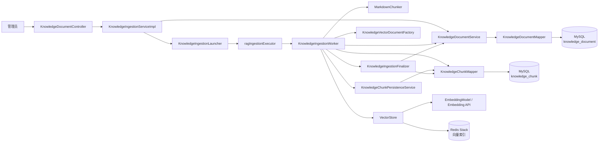
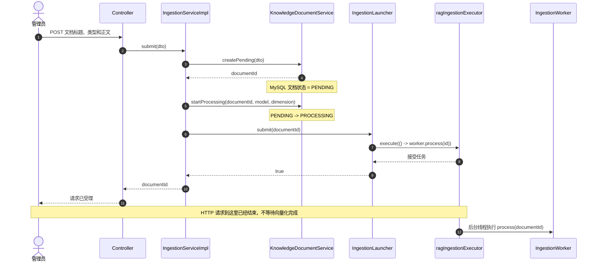
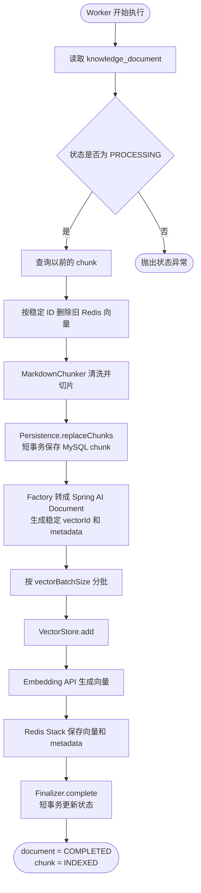
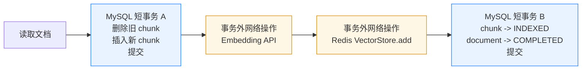
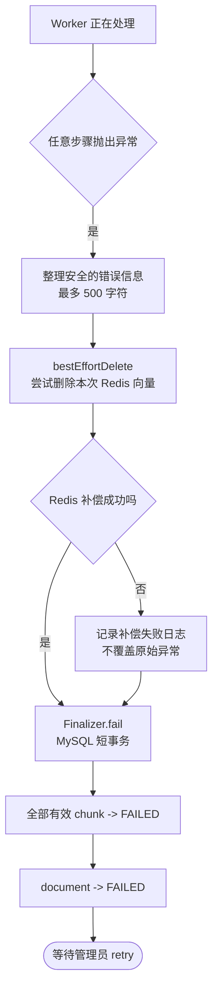
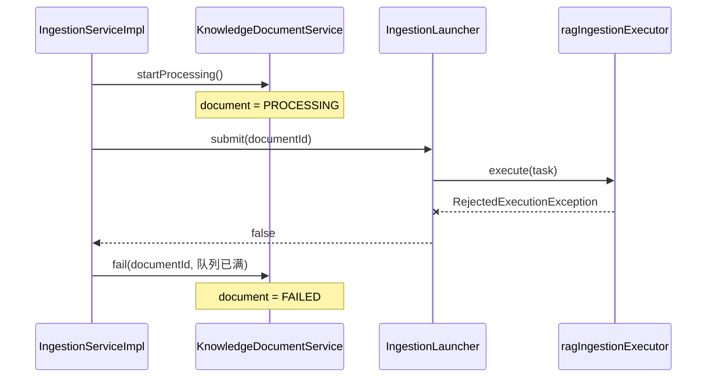
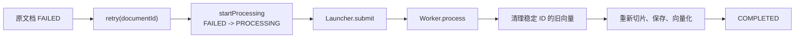

# 06：异步导入、向量化与最终一致性

> 对应智面 RAG 阶段任务：`6.6.3`。
>
> 项目路径：`E:\java-code\ZhiMian`
>
> 前置条件：03 已跑通 Embedding 与 Redis VectorStore，04 已完成知识库表、Mapper 和状态机，05 已完成 Markdown/TXT 清洗、标题解析和 Token 切片。
>
> 本阶段学习方式：先理解同步与异步、事务边界、幂等和补偿，再按检查点手敲代码。不要一次创建完所有类。每完成一个检查点先运行对应测试，再进入下一部分。
>
> 上一篇：[05-Markdown清洗与智能切片.md](./05-Markdown清洗与智能切片.md)
>
> 字符串基础补充：[专题01-Java字符串、字符编码与文本处理.md](./专题01-Java字符串、字符编码与文本处理.md)

---

## 一、先看清 03、04、05 与 06 的关系

前三个阶段分别解决了一个独立问题。

### 1.1 03 解决“向量能力能不能工作”

03 已经证明：

```text
中文文本
    ↓
Embedding API
    ↓
1024 维向量
    ↓
Redis Stack
    ↓
语义相似度检索
```

但 03 使用的是测试代码临时创建的 `Document`，没有真实知识文档，也没有业务状态。

### 1.2 04 解决“知识数据由谁管理”

04 建立：

```text
knowledge_document
    管理整份文档、处理状态、模型与错误信息

knowledge_chunk
    管理切片正文、顺序、标题路径与向量状态
```

MySQL 成为事实来源，Redis 是可以重建的向量索引。

### 1.3 05 解决“整篇文档怎样变成可检索片段”

05 已经能够执行：

```text
Markdown/TXT
    ↓ Cleaner
规范文本
    ↓ SectionParser
标题章节
    ↓ TokenWindowSplitter
带 overlap 的片段
    ↓ MarkdownChunker
List<KnowledgeChunkDraft>
```

但它是纯计算组件，不访问 MySQL、Redis 和网络。

### 1.4 06 要把前三部分连成第一条真实数据管道

本阶段要实现：

```text
管理员提交知识文档
        ↓
knowledge_document = PENDING
        ↓
knowledge_document = PROCESSING
        ↓ 放入专用线程池
异步 Worker
        ↓
MarkdownChunker
        ↓
knowledge_chunk 批量写入 MySQL
        ↓
VectorStore.add 分批向量化并写入 Redis
        ↓
chunk = INDEXED
document = COMPLETED
```

失败时：

```text
任意步骤异常
    ↓
清理本次可能写入的 Redis 向量
    ↓
chunk = FAILED
document = FAILED
    ↓
允许管理员 retry
```

这才是智面第一条真正的“知识进入系统”链路。

---

## 二、本阶段真正要学习什么

06 的重点不是再调用一次 Embedding API。03 已经证明你会调用。

本阶段的核心知识是：

1. 请求线程与后台线程有什么区别；
2. 为什么耗时任务需要异步；
3. 线程池为什么必须有界；
4. 队列满了应该怎样处理；
5. `@Transactional` 到底保护什么；
6. 为什么 MySQL 事务保护不了 Redis；
7. 什么是双写不一致；
8. 什么是幂等、补偿和最终一致性；
9. 为什么异步线程不能读取 `UserContext`；
10. 为什么状态机是异步任务的“业务日志”。

完成后，你不仅会做 RAG 导入，也能把这些思想迁移到：

- 面试报告生成；
- AI 问题收录；
- 邮件和消息发送；
- 文件转码；
- 批量数据导入；
- 支付回调处理；
- 消息队列消费。

---

## 三、同步与异步

### 3.1 什么是同步执行

同步表示调用者必须等待方法全部完成：

```text
HTTP 请求进入
    ↓
保存文档
    ↓
切片
    ↓
调用 20 次 Embedding
    ↓
写 Redis
    ↓
返回 HTTP 响应
```

如果 Embedding 用时 30 秒，用户的 HTTP 请求就等待 30 秒。

同步的优点：

- 执行顺序直观；
- 异常可以直接返回给调用者；
- 调试简单。

同步的缺点：

- HTTP 连接长时间占用；
- 网关、Nginx 或浏览器可能超时；
- 用户刷新页面可能重复提交；
- 大文档拖慢 Web 线程；
- AI 服务抖动会直接影响接口可用性。

### 3.2 什么是异步执行

异步表示请求只负责创建任务，然后尽快返回：

```text
HTTP 请求进入
    ↓
保存文档并创建任务状态
    ↓
提交到后台线程池
    ↓
立即返回 documentId

后台线程：切片 -> MySQL -> Embedding -> Redis -> 更新状态
```

前端之后根据 `documentId` 查询：

```text
PROCESSING
COMPLETED
FAILED
```

### 3.3 异步不是“更快”

同一份文档的总处理时间不会因为异步自动减少。异步主要改变：

```text
谁在等待
```

同步时，HTTP 请求线程等待；异步时，后台线程执行，用户可以先得到任务 ID。

### 3.4 异步也不是“开线程越多越好”

Embedding 调用受以下因素限制：

- API 限流；
- 网络带宽；
- 服务端并发额度；
- Redis 写入速度；
- 每次调用的 Token 数量；
- 费用预算。

如果同时开 100 个线程，可能得到的不是 100 倍速度，而是：

```text
429 限流
连接超时
任务大量重试
内存上涨
费用失控
```

智面第一版使用小型专用线程池，先求稳定和可理解。

---

## 四、线程池的五个核心参数

Java `ThreadPoolExecutor` 的核心结构：

```text
任务提交
    ↓
核心线程是否有空位
    ↓ 否
有界队列是否有位置
    ↓ 否
是否还能创建非核心线程
    ↓ 否
执行拒绝策略
```

### 4.1 `corePoolSize`

长期保留的核心线程数量。

RAG 第一版建议：

```text
1
```

先让一份文档稳定执行，再根据实际耗时和 API 限额增加。

### 4.2 `maximumPoolSize`

队列满时允许扩展到的最大线程数。

建议：

```text
2
```

### 4.3 `keepAliveTime`

非核心线程空闲多久后销毁。

建议：

```text
60 秒
```

### 4.4 `workQueue`

等待执行的任务队列。

必须使用有界队列：

```java
new LinkedBlockingQueue<>(20)
```

如果使用无限队列，大量文档会一直堆在内存里，最终可能 OOM。

### 4.5 `RejectedExecutionHandler`

线程和队列都满时的拒绝策略。

RAG 不建议使用：

```java
new ThreadPoolExecutor.CallerRunsPolicy()
```

因为它会让提交任务的 HTTP 线程亲自执行 Embedding，异步接口会突然退化成几十秒的同步接口。

推荐：

```java
new ThreadPoolExecutor.AbortPolicy()
```

然后捕获 `RejectedExecutionException`，把文档标记为失败，允许稍后重试。

这就是背压：系统明确告诉上游“当前处理不过来”，而不是无限接收任务。

---

## 五、事务边界与双写问题

### 5.1 MySQL 事务能保证什么

下面两个数据库操作可以放入同一个事务：

```text
删除旧 knowledge_chunk
批量插入新 knowledge_chunk
```

如果第二步失败，第一步也会回滚。

### 5.2 MySQL 事务不能保证什么

下面两个操作不能依靠普通 `@Transactional` 一起回滚：

```text
MySQL INSERT
Redis VectorStore.add
```

原因是：

```text
MySQL 有自己的事务管理器
Redis VectorStore 是另一个外部系统
Embedding API 又是第三个远程系统
```

Spring 的数据库事务提交或回滚，并不会让外部 Embedding API“撤销调用”，也不会自动删除 Redis 向量。

### 5.3 什么是双写不一致

场景一：

```text
MySQL chunk 写入成功
Redis 写入失败
```

结果：MySQL 认为有片段，Redis 却无法检索。

场景二：

```text
Redis 写入成功
更新 MySQL COMPLETED 失败
```

结果：Redis 中已经有向量，MySQL 仍显示处理中。

这类问题叫双写不一致。

### 5.4 为什么本项目采用最终一致性

分布式事务可以处理部分场景，但会增加很多复杂度。智面当前规模不需要一开始引入 Seata、XA 或复杂消息系统。

本项目采用：

```text
状态机 + 稳定向量 ID + 幂等重试 + 失败补偿
```

含义是：短时间内 MySQL 和 Redis 可能不一致，但系统能检测、清理并重试，最终恢复到一致状态。

---

## 六、四个必须理解的工程概念

### 6.1 幂等

同一个操作执行一次或多次，最终结果相同。

例如同一个 chunk 永远使用：

```text
knowledge-chunk:{chunkId}
```

作为 Redis `Document.id`。重复写入时不会每次制造一个随机新 ID。

### 6.2 补偿

某一步已经成功，但后续失败时，主动执行反向操作。

```text
Redis 已写入部分向量
    ↓ 后续失败
vectorStore.delete(本次全部向量ID)
```

这不是数据库自动回滚，而是业务代码主动清理。

### 6.3 重试

失败后重新执行完整处理流程。

重试前需要：

```text
清理旧向量
删除或替换旧 chunk
重新切片
重新向量化
```

### 6.4 可恢复状态

异步方法的异常无法直接显示在原来的 HTTP 响应中，因此错误必须写入数据库：

```text
knowledge_document.status
knowledge_document.error_message
knowledge_chunk.vector_status
knowledge_chunk.error_message
```

数据库状态就是异步任务的业务日志和恢复入口。

---

## 七、本阶段的设计原则

### 7.1 网络调用不能放在长事务中

错误做法：

```java
@Transactional
public void process() {
    insertChunks();
    vectorStore.add(documents); // 可能等待几十秒
    markCompleted();
}
```

问题：

- 数据库连接和事务长时间占用；
- 行锁持有时间过长；
- 网络超时导致事务一直悬挂；
- Redis 成功后 MySQL 回滚仍然不一致。

正确拆分：

```text
短事务 A：替换 MySQL chunks
事务外：Embedding + Redis
短事务 B：标记 chunks 和文档完成
```

### 7.2 `@Transactional` 方法必须通过 Spring 代理调用

同一个类中：

```java
public void outer() {
    this.inner();
}

@Transactional
public void inner() {
}
```

`this.inner()` 没有经过 Spring 代理，事务可能不生效。

所以本阶段把事务操作拆成独立 Bean：

```text
KnowledgeChunkPersistenceService
KnowledgeIngestionFinalizer
KnowledgeIngestionWorker
```

Worker 调用另外两个 Spring Bean，事务代理才能正常工作。

### 7.3 异步线程不能读取 `UserContext`

项目的 `UserContext` 基于 `ThreadLocal`。它只存在于处理当前 HTTP 请求的线程。

错误：

```java
executor.execute(() -> {
    Long userId = UserContext.getUserId();
});
```

后台线程通常得不到请求线程中的 userId。

正确流程：

```text
请求线程读取 UserContext.getUserId()
    ↓
保存到 knowledge_document.created_by
    ↓
后台线程通过 documentId 从 MySQL 读取
```

### 7.4 不复用报告线程池

项目已有：

```text
reportExecutor
questionCollectExecutor
```

不要把 RAG 导入任务塞进去。不同任务的耗时、失败方式和容量不同，共用线程池会相互拖累。

---

## 八、最终组件结构

本阶段建议新增：

```text
src/main/java/com/zhimian
├── config
│   ├── AppConfig.java                              修改
│   └── RagProperties.java                         修改
├── mapper
│   └── KnowledgeChunkMapper.java                  修改
├── model
│   ├── dto/KnowledgeDocumentImportDTO.java        新建
│   └── vo/KnowledgeDocumentStatusVO.java          新建
├── rag/ingestion
│   ├── KnowledgeVectorDocumentFactory.java        新建
│   ├── KnowledgeChunkPersistenceService.java      新建
│   ├── KnowledgeIngestionFinalizer.java           新建
│   ├── KnowledgeIngestionWorker.java              新建
│   └── KnowledgeIngestionLauncher.java            新建
├── service
│   └── KnowledgeIngestionService.java             新建
├── service/impl
│   └── KnowledgeIngestionServiceImpl.java         新建
└── controller
    └── KnowledgeDocumentController.java           最后创建

src/main/resources/mapper
└── KnowledgeChunkMapper.xml                       修改

src/test/java/com/zhimian/rag/ingestion
├── KnowledgeVectorDocumentFactoryTest.java
├── KnowledgeChunkPersistenceServiceTest.java
├── KnowledgeIngestionFinalizerTest.java
├── KnowledgeIngestionWorkerTest.java
└── KnowledgeIngestionLauncherTest.java

src/test/java/com/zhimian/service/impl
└── KnowledgeIngestionServiceImplTest.java
```

职责关系：

```text
Controller
    只接收管理员请求
        ↓
KnowledgeIngestionService
    创建任务、改变状态、提交后台执行
        ↓
KnowledgeIngestionLauncher
    只负责线程池提交与拒绝处理
        ↓
KnowledgeIngestionWorker
    编排完整处理流程，但自己不开长事务
        ├── MarkdownChunker
        ├── KnowledgeChunkPersistenceService
        ├── KnowledgeVectorDocumentFactory
        ├── VectorStore
        └── KnowledgeIngestionFinalizer
```

### 8.1 先用一张图看懂所有类的关系

下面这张图回答的是：**每个类依赖谁，以及它把工作交给了谁。**



可以把这些类分成四层：

| 层次 | 组件 | 主要职责 |
|---|---|---|
| 接口层 | `KnowledgeDocumentController` | 接收参数、取得当前管理员 ID、返回任务 ID |
| 任务层 | `KnowledgeIngestionServiceImpl`、`KnowledgeIngestionLauncher` | 创建任务、改变状态、提交线程池 |
| 编排层 | `KnowledgeIngestionWorker` | 决定清洗、切片、保存、向量化、完成或失败的顺序 |
| 能力层 | Chunker、Persistence、Factory、VectorStore、Finalizer | 每个组件只完成一种具体能力 |

这里最重要的不是类的数量，而是职责边界：

```text
Controller 不处理文档
Service 不直接创建线程
Launcher 不懂 RAG 业务
Worker 不自己实现每一个细节
Persistence 不调用外部网络
Finalizer 只收口 MySQL 状态
```

### 8.2 提交任务时是怎么运作的

下面是管理员第一次导入文档时的完整时序图：



注意这里存在两条执行线：

```text
接口线程：Controller -> Service -> Launcher -> 返回 documentId

后台线程：Executor -> Worker -> 清洗切片 -> MySQL -> Embedding -> Redis
```

所以“接口返回成功”只表示：

> 文档记录创建成功，并且后台任务已经被线程池接受。

它不表示向量已经生成。管理员需要通过状态查询接口观察：

```text
PENDING -> PROCESSING -> COMPLETED
                       -> FAILED
```

### 8.3 Worker 成功执行的主流程

`KnowledgeIngestionWorker.process(documentId)` 是 06 的业务主线：



逐步理解：

1. Worker 只接收 `documentId`，不接收 Controller 的请求对象，也不依赖登录线程。
2. 它重新从 MySQL 读取文档，保证后台线程拿到的是数据库中的真实任务。
3. 重试前先清理稳定 ID 对应的旧向量，避免 Redis 出现重复数据。
4. `MarkdownChunker` 把 05 已完成的纯文本能力接入真实流程。
5. `replaceChunks()` 用短事务替换 MySQL 中的片段。
6. Factory 把数据库实体转换成 Spring AI 的 `Document`。
7. `VectorStore.add()` 内部调用 Embedding API，然后将结果写入 Redis Stack。
8. 全部批次成功后，Finalizer 才把文档和片段标记为完成。

这里要区分两个名字很相似的类型：

```text
KnowledgeDocument
    项目自己的 MySQL 实体，代表整份知识文档

org.springframework.ai.document.Document
    Spring AI 的向量文档，代表要交给 VectorStore 的一个 chunk
```

### 8.4 MySQL 和 Redis 的事务边界

整个 Worker **不能**包在一个大 `@Transactional` 中。正确边界如下：



两个短事务分别由不同组件负责：

| 事务 | 所在方法 | 保护的数据 |
|---|---|---|
| MySQL 短事务 A | `KnowledgeChunkPersistenceService.replaceChunks()` | 删除旧 chunk 和插入新 chunk 必须一起成功 |
| MySQL 短事务 B | `KnowledgeIngestionFinalizer.complete()` | chunk 的 INDEXED 与文档的 COMPLETED 必须一起成功 |

Embedding 和 Redis 位于两个事务中间，但不属于 MySQL 事务。这是因为：

- 网络调用可能很慢；
- MySQL 事务无法让远程 Embedding API 回滚；
- MySQL 事务也无法自动回滚 Redis；
- 长时间占用数据库连接会降低系统并发能力。

因此本项目使用的是：

```text
MySQL 局部事务
    +
稳定向量 ID
    +
失败补偿
    +
可重试状态
    =
最终一致性
```

### 8.5 任意一步失败后怎么运作

Worker 使用一个总的 `try/catch` 接住导入异常：



`KnowledgeIngestionFinalizer.fail()` 会在同一个 MySQL 事务里执行：

```java
chunkMapper.markAllFailedByDocumentId(documentId, errorMessage);
documentService.fail(documentId, errorMessage);
```

这正是三种失败状态更新不能混在一起的原因：

```text
KnowledgeChunkMapper.markFailed(id, message)
    只处理一个 chunk

KnowledgeChunkMapper.markAllFailedByDocumentId(documentId, message)
    处理整份文档的全部 chunk

KnowledgeDocumentMapper.markFailed(id, message)
    处理 knowledge_document 本身
```

如果 Redis 补偿删除失败，MySQL 仍然要进入 `FAILED`。下次执行 `retry(documentId)` 时，会根据稳定向量 ID 再次尝试删除旧向量，再重新切片和写入。

### 8.6 线程池队列满时怎么运作

线程池拒绝任务发生在 Worker 执行以前：



为什么不能忽略拒绝结果？

如果 `submit()` 没有返回 `boolean`，文档可能已经变成 `PROCESSING`，但实际上任务没有进入线程池，它会永远卡住。现在由 Service 检查返回值，并立即把文档改成 `FAILED`，管理员稍后可以重试。

### 8.7 重试不是创建一份新文档

重试流程复用原来的 `documentId`：



不新建文档的好处：

- 不会因为一次失败产生多条相同文档记录；
- 管理员看到的是同一个任务的状态变化；
- 稳定 vectorId 仍然可以精确清理旧向量；
- `content_hash` 唯一约束不会阻止正常重试。

### 8.8 最后用一句话记住整条链路

```text
Controller 接请求
    -> Service 建任务并改状态
    -> Launcher 把 documentId 交给专用线程池
    -> Worker 编排 05 的切片、04 的 MySQL 状态和 03 的向量能力
    -> 成功时 Finalizer 一起收口文档与 chunk 状态
    -> 失败时删除 Redis 向量并把 MySQL 标记为 FAILED
```

06 不是在重复实现 03、04、05，而是在学习如何把已经验证过的独立能力，组合成一条可以异步执行、失败恢复并且能够测试的工程流程。

---

## 九、阶段检查点

不要一次敲完全部代码。按以下顺序：

```text
检查点 A：配置专用线程池和批次参数
    ↓
检查点 B：把 ChunkDraft 稳定保存到 MySQL
    ↓
检查点 C：把 KnowledgeChunk 转成 Spring AI Document
    ↓
检查点 D：同步调用 Worker 跑通完整导入
    ↓
检查点 E：增加补偿和失败状态
    ↓
检查点 F：最后增加异步 Launcher
    ↓
检查点 G：增加管理员接口和真实集成测试
```

先同步验证 Worker，再包异步，是本阶段最重要的学习顺序。

如果一开始就进入线程池，发生错误时你会同时怀疑：

- 业务代码；
- 事务；
- 线程池；
- ThreadLocal；
- Embedding；
- Redis。

一次只增加一个未知变量，排错效率会高很多。

---

## 十、检查点 A：增加配置

### 10.1 修改 `RagProperties`

在现有字段后增加：

```java
private String embeddingModel = "BAAI/bge-m3";
private int vectorBatchSize = 16;
private int ingestionCorePoolSize = 1;
private int ingestionMaxPoolSize = 2;
private int ingestionQueueCapacity = 20;
```

这些字段分别表示：

| 字段 | 作用 |
|---|---|
| `embeddingModel` | 记录当前导入使用的模型名 |
| `vectorBatchSize` | 每次交给 VectorStore 的 chunk 数量 |
| `ingestionCorePoolSize` | RAG 核心线程数 |
| `ingestionMaxPoolSize` | RAG 最大线程数 |
| `ingestionQueueCapacity` | 等待导入的文档任务数量 |

### 10.2 修改 `application.yml`

在现有 `zhimian.rag` 中增加：

```yaml
zhimian:
  rag:
    chunk-size-tokens: 500
    chunk-overlap-tokens: 80
    max-chunks-per-document: 1000
    embedding-model: ${RAG_EMBEDDING_MODEL:BAAI/bge-m3}
    vector-batch-size: 16
    ingestion-core-pool-size: 1
    ingestion-max-pool-size: 2
    ingestion-queue-capacity: 20
```

Spring AI 的模型配置与业务审计字段必须使用同一个环境变量：

```yaml
spring:
  ai:
    openai:
      embedding:
        options:
          model: ${RAG_EMBEDDING_MODEL:BAAI/bge-m3}
```

这样避免：

```text
实际调用 bge-m3
数据库却记录另一个模型
```

API Key 仍然只能放在 `application-local.yml` 或部署环境变量中。

### 10.3 在 `AppConfig` 增加专用线程池

```java
@Bean(name = "ragIngestionExecutor", destroyMethod = "shutdown")
public Executor ragIngestionExecutor(RagProperties properties) {
    return new ThreadPoolExecutor(
            properties.getIngestionCorePoolSize(),
            properties.getIngestionMaxPoolSize(),
            60,
            TimeUnit.SECONDS,
            new LinkedBlockingQueue<>(
                    properties.getIngestionQueueCapacity()),
            runnable -> {
                Thread thread = new Thread(runnable);
                thread.setName("rag-ingestion-" + thread.getId());
                return thread;
            },
            new ThreadPoolExecutor.AbortPolicy()
    );
}
```

`destroyMethod = "shutdown"` 的意义：Spring 容器关闭时停止接收新任务，并回收线程池资源。

### 10.4 配置校验

至少满足：

```text
corePoolSize > 0
maxPoolSize >= corePoolSize
queueCapacity > 0
vectorBatchSize > 0
```

可以先在 `ragIngestionExecutor()` 中抛出 `IllegalStateException`，后续再学习 Bean Validation 的 `@Validated @ConfigurationProperties`。

---

## 十一、检查点 B（第一步）：补充 Chunk 失败 Mapper

当前 Mapper 能标记单个 chunk 失败：

```java
int markFailed(Long id, String errorMessage);
```

文档导入失败时通常需要一次标记整份文档的所有 chunk。逐条更新会产生 N 次 SQL。

### 11.1 新增接口方法

这里是**新增**方法，不是删除或替换原来的 `markFailed`：

```java
int markFailed(
        @Param("id") Long id,
        @Param("errorMessage") String errorMessage
);
```

两个方法的职责不同：

| 方法 | 更新范围 | 使用场景 |
|---|---|---|
| `markFailed(id, errorMessage)` | 一个 chunk | 某一个片段需要单独重试或单独标记失败 |
| `markAllFailedByDocumentId(documentId, errorMessage)` | 同一文档的全部有效 chunk | 整个导入任务失败，需要一次性同步片段状态 |

因此 `KnowledgeChunkMapper` 最后应该同时保留这两个方法。

```java
int markAllFailedByDocumentId(
        @Param("documentId") Long documentId,
        @Param("errorMessage") String errorMessage
);
```

这里也**不修改**现有的 `KnowledgeDocumentServiceImpl.fail()`。它调用的是
`KnowledgeDocumentMapper.markFailed()`，更新目标是 `knowledge_document`，表示整份文档导入失败；
新增加的 Mapper 方法更新的是 `knowledge_chunk`，表示该文档下的片段向量化失败。

06 后面会由 `KnowledgeIngestionFinalizer.fail()` 在同一个 MySQL 事务中调用两者：

```text
KnowledgeIngestionFinalizer.fail(documentId, errorMessage)
    ├── KnowledgeChunkMapper.markAllFailedByDocumentId(...)
    │       更新 knowledge_chunk
    └── KnowledgeDocumentService.fail(...)
            调用 KnowledgeDocumentMapper.markFailed(...)
            更新 knowledge_document
```

这样文档状态和片段状态才能一起提交或一起回滚。

### 11.2 修改 XML

```xml
<update id="markAllFailedByDocumentId">
    UPDATE knowledge_chunk
    SET vector_status = 2,
        error_message = #{errorMessage},
        update_time = NOW()
    WHERE document_id = #{documentId}
      AND is_deleted = 0
</update>
```

为什么不是只更新 `vector_status = 0`：

```text
失败补偿会尝试删除本次全部向量
删除后整份文档的 chunk 都不应该继续宣称 INDEXED
```

### 11.3 更新 Mapper 集成测试

在 `KnowledgeMapperIntegrationTest` 增加验证：

```java
assertThat(chunkMapper.markAllFailedByDocumentId(
        document.getId(), "批量向量化失败"
)).isEqualTo(2);

assertThat(chunkMapper.selectByDocumentId(document.getId()))
        .allMatch(chunk -> chunk.getVectorStatus()
                .equals(KnowledgeChunkVectorStatus.FAILED.getCode()));
```

这一检查点只测试 MySQL，不涉及线程池和 Redis。

---

## 十二、检查点 B（第二步）：实现 Chunk 持久化短事务

新建：

```text
src/main/java/com/zhimian/rag/ingestion/KnowledgeChunkPersistenceService.java
```

代码：

```java
package com.zhimian.rag.ingestion;

import com.zhimian.mapper.KnowledgeChunkMapper;
import com.zhimian.model.dto.KnowledgeChunkDraft;
import com.zhimian.model.entity.KnowledgeChunk;
import com.zhimian.model.enums.KnowledgeChunkVectorStatus;
import lombok.RequiredArgsConstructor;
import org.springframework.stereotype.Service;
import org.springframework.transaction.annotation.Transactional;

import java.util.List;

@Service
@RequiredArgsConstructor
public class KnowledgeChunkPersistenceService {

    private final KnowledgeChunkMapper chunkMapper;

    @Transactional
    public List<KnowledgeChunk> replaceChunks(
            Long documentId,
            List<KnowledgeChunkDraft> drafts) {
        if (documentId == null) {
            throw new IllegalArgumentException("documentId 不能为空");
        }
        if (drafts == null || drafts.isEmpty()) {
            throw new IllegalArgumentException("切片结果不能为空");
        }

        chunkMapper.deleteByDocumentId(documentId);

        List<KnowledgeChunk> chunks = drafts.stream()
                .map(draft -> toEntity(documentId, draft))
                .toList();

        int inserted = chunkMapper.batchInsert(chunks);
        if (inserted != chunks.size()) {
            throw new IllegalStateException("知识片段批量保存不完整");
        }

        List<KnowledgeChunk> saved =
                chunkMapper.selectByDocumentId(documentId);
        if (saved.size() != chunks.size()
                || saved.stream().anyMatch(chunk -> chunk.getId() == null)) {
            throw new IllegalStateException("知识片段保存后回查失败");
        }

        return List.copyOf(saved);
    }

    private KnowledgeChunk toEntity(Long documentId,
                                    KnowledgeChunkDraft draft) {
        KnowledgeChunk chunk = new KnowledgeChunk();
        chunk.setDocumentId(documentId);
        chunk.setChunkIndex(draft.chunkIndex());
        chunk.setHeadingPath(draft.headingPath());
        chunk.setContent(draft.content());
        chunk.setContentHash(draft.contentHash());
        chunk.setTokenCount(draft.tokenCount());
        chunk.setVectorStatus(
                KnowledgeChunkVectorStatus.PENDING.getCode());
        return chunk;
    }
}
```

### 12.1 为什么这里物理删除旧 chunk

`knowledge_chunk` 是从完整文档派生出来的数据。重试时切片参数可能发生变化：

```text
第一次：500/80，产生 10 个 chunk
第二次：400/60，产生 13 个 chunk
```

继续复用旧行会让索引、Hash 和顺序混乱。因此在短事务里：

```text
删除旧 chunk
插入新 chunk
```

如果插入失败，事务会恢复旧数据。

### 12.2 为什么插入后必须回查

当前 `batchInsert` 没有可靠地把每个自增 ID 回填到 Java List。Redis 向量需要稳定关联 `chunk.id`，所以插入后按 `documentId` 回查。

### 12.3 这一事务为什么短

事务里只有数据库操作：

```text
DELETE
INSERT
SELECT
```

没有 Embedding 和 Redis 网络调用。

---

## 十三、检查点 C：建立稳定向量 ID 与 metadata

新建：

```text
src/main/java/com/zhimian/rag/ingestion/KnowledgeVectorDocumentFactory.java
```

代码：

```java
package com.zhimian.rag.ingestion;

import com.zhimian.model.entity.KnowledgeChunk;
import com.zhimian.model.entity.KnowledgeDocument;
import org.springframework.ai.document.Document;
import org.springframework.stereotype.Component;
import org.springframework.util.StringUtils;

import java.util.HashMap;
import java.util.Map;

@Component
public class KnowledgeVectorDocumentFactory {

    private static final String VECTOR_ID_PREFIX = "knowledge-chunk:";

    public Document create(KnowledgeDocument source,
                           KnowledgeChunk chunk) {
        if (source == null || source.getId() == null) {
            throw new IllegalArgumentException("知识文档不能为空");
        }
        if (chunk == null || chunk.getId() == null) {
            throw new IllegalArgumentException("知识片段不能为空");
        }

        String headingPath = StringUtils.hasText(chunk.getHeadingPath())
                ? chunk.getHeadingPath().strip()
                : source.getTitle();

        String embeddingText = "知识路径："
                + headingPath
                + "\n\n"
                + chunk.getContent();

        Map<String, Object> metadata = new HashMap<>();
        metadata.put("documentId", source.getId().toString());
        metadata.put("chunkId", chunk.getId().toString());
        metadata.put("chunkIndex", chunk.getChunkIndex());
        metadata.put("headingPath", headingPath);
        metadata.put("documentTitle", source.getTitle());
        metadata.put("sourceType", source.getSourceType());

        return Document.builder()
                .id(vectorId(chunk.getId()))
                .text(embeddingText)
                .metadata(metadata)
                .build();
    }

    public String vectorId(Long chunkId) {
        if (chunkId == null) {
            throw new IllegalArgumentException("chunkId 不能为空");
        }
        return VECTOR_ID_PREFIX + chunkId;
    }
}
```

### 13.1 为什么不用随机 UUID

如果每次重试都随机生成 ID：

```text
第一次：uuid-A
第二次：uuid-B
```

旧向量可能无法定位和删除，Redis 会逐渐积累重复数据。

稳定 ID：

```text
knowledge-chunk:1024
```

使 MySQL chunk 与 Redis Document 一一对应。

### 13.2 为什么 Embedding 文本包含标题路径

正文可能只有：

```text
它会让调用线程执行任务，从而形成反压。
```

加入标题路径后：

```text
知识路径：Java > 线程池 > 拒绝策略

它会让调用线程执行任务，从而形成反压。
```

语义更完整，检索更容易命中正确主题。

### 13.3 metadata 为什么重要

07 检索阶段需要：

- 根据命中结果回查 MySQL 原文；
- 展示引用标题和章节；
- 按文档、类型或知识范围过滤；
- 合并相邻 chunk；
- 调试错误向量。

没有 metadata，Redis 只会返回一段孤立文本。

---

## 十四、检查点 D：完成状态的短事务

新建：

```text
src/main/java/com/zhimian/rag/ingestion/KnowledgeIngestionFinalizer.java
```

代码：

```java
package com.zhimian.rag.ingestion;

import com.zhimian.mapper.KnowledgeChunkMapper;
import com.zhimian.service.KnowledgeDocumentService;
import lombok.RequiredArgsConstructor;
import org.springframework.stereotype.Service;
import org.springframework.transaction.annotation.Transactional;

import java.util.List;

@Service
@RequiredArgsConstructor
public class KnowledgeIngestionFinalizer {

    private final KnowledgeChunkMapper chunkMapper;
    private final KnowledgeDocumentService documentService;

    @Transactional
    public void complete(Long documentId, List<Long> chunkIds) {
        if (chunkIds == null || chunkIds.isEmpty()) {
            throw new IllegalArgumentException("chunkIds 不能为空");
        }

        int updated = chunkMapper.markIndexed(chunkIds);
        if (updated != chunkIds.size()) {
            throw new IllegalStateException("知识片段索引状态更新不完整");
        }

        documentService.complete(documentId, chunkIds.size());
    }

    @Transactional
    public void fail(Long documentId, String errorMessage) {
        chunkMapper.markAllFailedByDocumentId(
                documentId, errorMessage);
        documentService.fail(documentId, errorMessage);
    }
}
```

这里的 `complete()` 在一个 MySQL 事务中完成：

```text
所有 chunk -> INDEXED
document -> COMPLETED
```

如果文档状态更新失败，chunk 状态更新也会回滚。

注意：Redis 向量已经在事务外写完。这仍然不是跨库强事务，Worker 负责在这里失败时删除 Redis 向量。

---

## 十五、检查点 D/E：编写同步 Worker

新建：

```text
src/main/java/com/zhimian/rag/ingestion/KnowledgeIngestionWorker.java
```

先把它当普通同步组件测试。代码本身不创建线程。

```java
package com.zhimian.rag.ingestion;

import com.zhimian.config.RagProperties;
import com.zhimian.mapper.KnowledgeChunkMapper;
import com.zhimian.model.dto.KnowledgeChunkDraft;
import com.zhimian.model.entity.KnowledgeChunk;
import com.zhimian.model.entity.KnowledgeDocument;
import com.zhimian.model.enums.KnowledgeDocumentStatus;
import com.zhimian.rag.MarkdownChunker;
import com.zhimian.service.KnowledgeDocumentService;
import lombok.RequiredArgsConstructor;
import lombok.extern.slf4j.Slf4j;
import org.springframework.ai.document.Document;
import org.springframework.ai.vectorstore.VectorStore;
import org.springframework.stereotype.Component;
import org.springframework.util.StringUtils;

import java.util.ArrayList;
import java.util.List;

@Slf4j
@Component
@RequiredArgsConstructor
public class KnowledgeIngestionWorker {

    private static final int MAX_ERROR_MESSAGE_LENGTH = 500;

    private final KnowledgeDocumentService documentService;
    private final KnowledgeChunkMapper chunkMapper;
    private final MarkdownChunker markdownChunker;
    private final KnowledgeChunkPersistenceService persistenceService;
    private final KnowledgeVectorDocumentFactory documentFactory;
    private final KnowledgeIngestionFinalizer finalizer;
    private final VectorStore vectorStore;
    private final RagProperties ragProperties;

    public void process(Long documentId) {
        List<String> currentVectorIds = List.of();

        try {
            KnowledgeDocument source = documentService.getById(documentId);
            ensureProcessing(source);

            List<KnowledgeChunk> previousChunks =
                    chunkMapper.selectByDocumentId(documentId);
            deleteVectors(previousChunks.stream()
                    .map(chunk -> documentFactory.vectorId(chunk.getId()))
                    .toList());

            List<KnowledgeChunkDraft> drafts = markdownChunker.chunk(
                    source.getTitle(),
                    source.getSourceType(),
                    source.getContent()
            );

            List<KnowledgeChunk> chunks = persistenceService.replaceChunks(
                    documentId, drafts);

            List<Document> vectorDocuments = chunks.stream()
                    .map(chunk -> documentFactory.create(source, chunk))
                    .toList();
            currentVectorIds = vectorDocuments.stream()
                    .map(Document::getId)
                    .toList();

            addInBatches(vectorDocuments);

            List<Long> chunkIds = chunks.stream()
                    .map(KnowledgeChunk::getId)
                    .toList();
            finalizer.complete(documentId, chunkIds);

            log.info("RAG知识文档处理完成: documentId={}, chunks={}",
                    documentId, chunks.size());
        } catch (Exception exception) {
            String errorMessage = safeErrorMessage(exception);
            bestEffortDelete(currentVectorIds);
            markFailedSafely(documentId, errorMessage);
            log.error("RAG知识文档处理失败: documentId={}",
                    documentId, exception);
        }
    }

    private void addInBatches(List<Document> documents) {
        int batchSize = ragProperties.getVectorBatchSize();
        if (batchSize <= 0) {
            throw new IllegalStateException("vectorBatchSize 必须大于 0");
        }

        for (int from = 0; from < documents.size(); from += batchSize) {
            int to = Math.min(from + batchSize, documents.size());
            vectorStore.add(new ArrayList<>(documents.subList(from, to)));
        }
    }

    private void deleteVectors(List<String> vectorIds) {
        if (vectorIds != null && !vectorIds.isEmpty()) {
            vectorStore.delete(vectorIds);
        }
    }

    private void bestEffortDelete(List<String> vectorIds) {
        try {
            deleteVectors(vectorIds);
        } catch (Exception cleanupException) {
            log.error("RAG失败补偿未能清理向量: ids={}",
                    vectorIds, cleanupException);
        }
    }

    private void markFailedSafely(Long documentId, String errorMessage) {
        try {
            finalizer.fail(documentId, errorMessage);
        } catch (Exception stateException) {
            log.error("RAG失败状态更新失败: documentId={}",
                    documentId, stateException);
        }
    }

    private void ensureProcessing(KnowledgeDocument source) {
        if (!Integer.valueOf(KnowledgeDocumentStatus.PROCESSING.getCode())
                .equals(source.getStatus())) {
            throw new IllegalStateException("知识文档不处于处理中状态");
        }
    }

    private String safeErrorMessage(Exception exception) {
        String message = exception.getClass().getSimpleName();
        if (StringUtils.hasText(exception.getMessage())) {
            message += ": " + exception.getMessage().strip();
        }
        return message.length() <= MAX_ERROR_MESSAGE_LENGTH
                ? message
                : message.substring(0, MAX_ERROR_MESSAGE_LENGTH);
    }
}
```

### 15.1 Worker 为什么自己没有 `@Transactional`

它包含远程调用：

```text
VectorStore.delete
VectorStore.add
Embedding API
```

Worker 只负责编排，真正需要事务的数据库片段由独立 Bean 完成。

### 15.2 为什么重试前先删除旧向量

上一次可能：

- 全部成功但完成状态写失败；
- 只成功写入一部分；
- 使用了旧切片参数；
- 在进程崩溃前没有执行补偿。

所以重试先根据旧 chunk ID 清理 Redis，再替换 MySQL chunk。

### 15.3 为什么 `vectorStore.add()` 要分批

一份文档可能有数百个 chunk。一次传入全部内容可能：

- 请求体过大；
- 单次 Token 数过高；
- 超过服务商批次限制；
- 失败后重试成本太大。

第一版批次为 16，后续根据真实 API 限额和耗时调整。

### 15.4 `VectorStore.add()` 已经会调用 EmbeddingModel

不要再手动写：

```java
embeddingModel.embed(...);
vectorStore.add(...);
```

否则同一文本可能调用两次 Embedding，增加费用和延迟。

### 15.5 为什么失败清理叫 best effort

系统本来就是因为外部服务异常进入 catch，补偿操作也可能失败。

因此：

```text
尽最大努力清理
清理失败必须记录日志
MySQL 文档仍标记 FAILED
下一次 retry 再次清理旧 ID
```

这就是最终一致性，而不是假装所有操作永远成功。

---

## 十六、检查点 F：最后才接入异步线程池

### 16.1 新建 Launcher

```text
src/main/java/com/zhimian/rag/ingestion/KnowledgeIngestionLauncher.java
```

```java
package com.zhimian.rag.ingestion;

import lombok.extern.slf4j.Slf4j;
import org.springframework.beans.factory.annotation.Qualifier;
import org.springframework.stereotype.Component;

import java.util.concurrent.Executor;
import java.util.concurrent.RejectedExecutionException;

@Slf4j
@Component
public class KnowledgeIngestionLauncher {

    private final Executor executor;
    private final KnowledgeIngestionWorker worker;

    public KnowledgeIngestionLauncher(
            @Qualifier("ragIngestionExecutor") Executor executor,
            KnowledgeIngestionWorker worker) {
        this.executor = executor;
        this.worker = worker;
    }

    public boolean submit(Long documentId) {
        try {
            executor.execute(() -> worker.process(documentId));
            return true;
        }
        catch (RejectedExecutionException exception) {
            log.warn("RAG任务队列已满: documentId={}", documentId);
            return false;
        }
    }
}
```

### 16.2 为什么不用 `CompletableFuture.runAsync()` 后不管返回值

如果返回的 `CompletableFuture` 没有保存，也没有注册异常处理，后台异常容易被忽略。

本阶段 Worker 自己完整捕获异常并写失败状态，所以 Launcher 只需要：

```java
executor.execute(...)
```

### 16.3 为什么不用 `@Async`

`@Async` 本身可以使用，但初学阶段容易踩到：

- 忘记 `@EnableAsync`；
- 同类自调用绕过代理；
- 没指定线程池而使用默认执行器；
- 异常处理不直观。

显式注入 `Executor` 能让线程池、拒绝策略和调用关系更清楚。理解后再学习 `@Async` 会更稳。

---

## 十七、检查点 F：编写任务入口 Service

### 17.1 接口

```java
package com.zhimian.service;

import com.zhimian.model.dto.KnowledgeDocumentCreateDTO;

public interface KnowledgeIngestionService {

    Long submit(KnowledgeDocumentCreateDTO dto);

    void retry(Long documentId);
}
```

### 17.2 实现

```java
package com.zhimian.service.impl;

import com.zhimian.config.RagProperties;
import com.zhimian.model.dto.KnowledgeDocumentCreateDTO;
import com.zhimian.rag.ingestion.KnowledgeIngestionLauncher;
import com.zhimian.service.KnowledgeDocumentService;
import com.zhimian.service.KnowledgeIngestionService;
import lombok.RequiredArgsConstructor;
import org.springframework.stereotype.Service;
import org.springframework.util.StringUtils;

@Service
@RequiredArgsConstructor
public class KnowledgeIngestionServiceImpl
        implements KnowledgeIngestionService {

    private final KnowledgeDocumentService documentService;
    private final KnowledgeIngestionLauncher launcher;
    private final RagProperties ragProperties;

    @Override
    public Long submit(KnowledgeDocumentCreateDTO dto) {
        validateModelConfiguration();
        Long documentId = documentService.createPending(dto);
        startAndDispatch(documentId);
        return documentId;
    }

    @Override
    public void retry(Long documentId) {
        validateModelConfiguration();
        documentService.getById(documentId);
        startAndDispatch(documentId);
    }

    private void startAndDispatch(Long documentId) {
        documentService.startProcessing(
                documentId,
                ragProperties.getEmbeddingModel(),
                ragProperties.getEmbeddingDimensions()
        );

        if (!launcher.submit(documentId)) {
            documentService.fail(
                    documentId,
                    "RAG任务队列已满，请稍后重试"
            );
        }
    }

    private void validateModelConfiguration() {
        if (!StringUtils.hasText(ragProperties.getEmbeddingModel())
                || ragProperties.getEmbeddingDimensions() <= 0) {
            throw new IllegalStateException(
                    "RAG Embedding模型配置不完整");
        }
    }
}
```

### 17.3 状态为什么在线程提交前改成 PROCESSING

如果先提交线程，再更新状态，后台线程可能立即执行并读到 `PENDING`，产生竞态条件。

正确顺序：

```text
PENDING -> PROCESSING
    ↓
提交后台任务
```

队列拒绝时：

```text
PROCESSING -> FAILED
```

### 17.4 为什么队列拒绝后仍返回 documentId

文档记录已经创建。如果此时抛异常，前端拿不到 ID，再次提交相同内容会触发重复 Hash 冲突。

返回 ID 后，前端可以查询到：

```text
FAILED：RAG任务队列已满，请稍后重试
```

然后调用 retry。

---

## 十八、检查点 G：管理员导入接口

本阶段先使用 JSON 提交文本，重点验证数据管道。真正的 `MultipartFile` 上传和前端进度页面在后续阶段补充。

### 18.1 请求 DTO

```java
package com.zhimian.model.dto;

import jakarta.validation.constraints.NotBlank;
import jakarta.validation.constraints.Size;
import lombok.Data;

@Data
public class KnowledgeDocumentImportDTO {

    @NotBlank(message = "文档标题不能为空")
    @Size(max = 200, message = "文档标题不能超过200个字符")
    private String title;

    @NotBlank(message = "原始文件名不能为空")
    @Size(max = 255, message = "原始文件名不能超过255个字符")
    private String originalFilename;

    @NotBlank(message = "来源类型不能为空")
    private String sourceType;

    @NotBlank(message = "文档内容不能为空")
    @Size(max = 2_000_000, message = "文档内容过大")
    private String content;
}
```

不要让前端提交 `createdBy`。创建人必须来自 JWT 解析后的 `UserContext`。

### 18.2 状态 VO

```java
package com.zhimian.model.vo;

import com.zhimian.model.entity.KnowledgeDocument;

import java.time.LocalDateTime;

public record KnowledgeDocumentStatusVO(
        Long id,
        String title,
        Integer status,
        Integer chunkCount,
        String embeddingModel,
        Integer vectorDimension,
        String errorMessage,
        LocalDateTime updateTime
) {
    public static KnowledgeDocumentStatusVO from(
            KnowledgeDocument document) {
        return new KnowledgeDocumentStatusVO(
                document.getId(),
                document.getTitle(),
                document.getStatus(),
                document.getChunkCount(),
                document.getEmbeddingModel(),
                document.getVectorDimension(),
                document.getErrorMessage(),
                document.getUpdateTime()
        );
    }
}
```

VO 不返回完整 `content`，避免状态轮询时重复传输整篇文档。

### 18.3 Controller

```java
package com.zhimian.controller;

import com.zhimian.annotation.RequireAdmin;
import com.zhimian.common.Result;
import com.zhimian.common.UserContext;
import com.zhimian.model.dto.KnowledgeDocumentCreateDTO;
import com.zhimian.model.dto.KnowledgeDocumentImportDTO;
import com.zhimian.model.vo.KnowledgeDocumentStatusVO;
import com.zhimian.service.KnowledgeDocumentService;
import com.zhimian.service.KnowledgeIngestionService;
import jakarta.validation.Valid;
import lombok.RequiredArgsConstructor;
import org.springframework.web.bind.annotation.*;

@RestController
@RequestMapping("/api/admin/knowledge-documents")
@RequiredArgsConstructor
public class KnowledgeDocumentController {

    private final KnowledgeIngestionService ingestionService;
    private final KnowledgeDocumentService documentService;

    @RequireAdmin
    @PostMapping
    public Result<Long> submit(
            @Valid @RequestBody KnowledgeDocumentImportDTO request) {
        KnowledgeDocumentCreateDTO command =
                new KnowledgeDocumentCreateDTO();
        command.setTitle(request.getTitle());
        command.setOriginalFilename(request.getOriginalFilename());
        command.setSourceType(request.getSourceType());
        command.setContent(request.getContent());
        command.setCreatedBy(UserContext.getUserId());

        return Result.success(ingestionService.submit(command));
    }

    @RequireAdmin
    @PutMapping("/{id}/retry")
    public Result<Void> retry(@PathVariable Long id) {
        ingestionService.retry(id);
        return Result.success();
    }

    @RequireAdmin
    @GetMapping("/{id}")
    public Result<KnowledgeDocumentStatusVO> status(
            @PathVariable Long id) {
        return Result.success(KnowledgeDocumentStatusVO.from(
                documentService.getById(id)));
    }
}
```

Controller 仍然只负责协议转换：

```text
HTTP DTO + UserContext
    ↓
内部 Command
    ↓
Service
```

它不应该直接调用 `MarkdownChunker`、Mapper 或 VectorStore。

---

## 十九、为什么暂时不做 MultipartFile

本阶段的核心未知点已经很多：

- 异步线程；
- 两个短事务；
- VectorStore；
- 失败补偿；
- 状态流转；
- 重试。

如果同时增加文件扩展名、MIME、编码检测和大小限制，排错范围会扩大。

先用 JSON 跑通：

```json
{
  "title": "Java线程池指南",
  "originalFilename": "thread-pool.md",
  "sourceType": "MARKDOWN",
  "content": "# 线程池\n\n## 拒绝策略\n\nCallerRunsPolicy..."
}
```

后续把文件读取成 UTF-8 String，再调用同一个 `KnowledgeIngestionService`，核心管道不需要改。

这体现了“先稳定核心，再增加输入适配器”。

---

## 二十、失败场景推演

### 20.1 Cleaner 或 Chunker 失败

```text
MySQL document = PROCESSING
尚未写入新 chunk
尚未写 Redis
```

处理：文档标记 FAILED。

### 20.2 Chunk 批量插入失败

`replaceChunks()` 事务回滚，旧 chunk 恢复。Worker 标记文档失败。

### 20.3 第一个向量批次失败

新 chunk 已进入 MySQL，Redis 可能没有新数据。Worker 删除本次全部稳定 ID，并把 chunk/document 标记 FAILED。

### 20.4 中间批次失败

前几个批次已经进入 Redis。Worker 使用本次全部 ID 执行删除。不存在的 ID 删除应当是幂等的。

### 20.5 Redis 成功，`complete()` 失败

Worker 删除本次向量，再尝试将文档标记 FAILED。

### 20.6 补偿删除也失败

记录错误日志，文档保持 FAILED。下一次 retry 会先根据旧 chunk ID 再次删除。

### 20.7 JVM 突然关闭

进程可能没有机会进入 catch，文档停留在 PROCESSING。

第一版先允许管理员人工识别和重试。完成主链路后再增加“超时 PROCESSING 扫描任务”：

```text
update_time 早于当前时间 30 分钟
    ↓
标记 FAILED：处理进程中断或超时
```

不要在核心链路未通过前先写恢复调度器。

---

## 二十一、单元测试为什么按组件拆分

### 21.1 Factory 测试

验证：

- ID 稳定；
- Embedding 文本包含标题路径；
- metadata 包含 MySQL 关联 ID；
- null 参数被拒绝。

示例：

```java
class KnowledgeVectorDocumentFactoryTest {

    private final KnowledgeVectorDocumentFactory factory =
            new KnowledgeVectorDocumentFactory();

    @Test
    void shouldBuildStableVectorDocument() {
        KnowledgeDocument source = new KnowledgeDocument();
        source.setId(10L);
        source.setTitle("Java并发");
        source.setSourceType("MARKDOWN");

        KnowledgeChunk chunk = new KnowledgeChunk();
        chunk.setId(20L);
        chunk.setChunkIndex(2);
        chunk.setHeadingPath("Java > 线程池");
        chunk.setContent("CallerRunsPolicy形成反压。");

        Document document = factory.create(source, chunk);

        assertEquals("knowledge-chunk:20", document.getId());
        assertTrue(document.getText().contains("Java > 线程池"));
        assertEquals("10", document.getMetadata().get("documentId"));
        assertEquals("20", document.getMetadata().get("chunkId"));
    }
}
```

### 21.2 Persistence 测试

使用 Mockito 验证：

```text
先 deleteByDocumentId
再 batchInsert
最后 selectByDocumentId
```

还要测试：

- batchInsert 返回数量不完整时抛异常；
- 回查数量不一致时抛异常；
- 空 Draft 被拒绝；
- 每个 Entity 的状态为 PENDING。

注意：Mockito 单元测试只能验证方法逻辑，真正的事务回滚仍由 `KnowledgeMapperIntegrationTest` 验证。

### 21.3 Finalizer 测试

成功路径：

```text
markIndexed 返回 chunkIds.size
documentService.complete 被调用
```

失败路径：

```text
markIndexed 数量不足
抛 IllegalStateException
documentService.complete 不应调用
```

### 21.4 Worker 测试

Worker 是本阶段最重要的测试对象。

至少覆盖：

```text
1. 成功导入并 complete
2. 旧向量在重试前被删除
3. 按 vectorBatchSize 分批 add
4. VectorStore.add 失败时执行 delete
5. 失败时 finalizer.fail
6. 非 PROCESSING 文档不继续处理
7. 错误信息截断到 500 字符
```

### 21.5 Launcher 测试

使用同步 Executor：

```java
Executor directExecutor = Runnable::run;
```

这样测试不会真的创建后台线程，但可以验证提交后 Worker 被调用。

拒绝测试：

```java
Executor rejectingExecutor = command -> {
    throw new RejectedExecutionException("queue full");
};
```

断言 `submit()` 返回 `false`。

### 21.6 Service 测试

验证状态顺序：

```text
createPending
startProcessing
launcher.submit
```

队列拒绝时验证：

```text
documentService.fail
```

---

## 二十二、Worker 测试示例

下面示例展示失败补偿的核心测试思路。你需要根据最终构造器参数补齐测试夹具。

```java
@Test
void shouldCleanupVectorsAndMarkFailedWhenVectorStoreFails() {
    KnowledgeDocument source = processingDocument(1L);
    KnowledgeChunk chunk = savedChunk(10L, 1L, 0);
    KnowledgeChunkDraft draft = new KnowledgeChunkDraft(
            0, "Java > 线程池", "正文", "hash", 10);

    when(documentService.getById(1L)).thenReturn(source);
    when(chunkMapper.selectByDocumentId(1L)).thenReturn(List.of());
    when(markdownChunker.chunk(anyString(), anyString(), anyString()))
            .thenReturn(List.of(draft));
    when(persistenceService.replaceChunks(1L, List.of(draft)))
            .thenReturn(List.of(chunk));
    when(documentFactory.create(source, chunk))
            .thenReturn(Document.builder()
                    .id("knowledge-chunk:10")
                    .text("正文")
                    .build());

    doThrow(new RuntimeException("embedding unavailable"))
            .when(vectorStore).add(anyList());

    worker.process(1L);

    verify(vectorStore).delete(List.of("knowledge-chunk:10"));
    verify(finalizer).fail(eq(1L), contains("embedding unavailable"));
    verify(finalizer, never()).complete(anyLong(), anyList());
}
```

这个测试没有真正调用 Redis，却精确验证了“向量化失败后必须补偿”这一业务契约。

---

## 二十三、真实集成测试

单元测试通过后，再写一个由环境变量控制的真实测试：

```java
@SpringBootTest
@EnabledIfEnvironmentVariable(
        named = "RUN_RAG_INGESTION_TESTS",
        matches = "true"
)
class KnowledgeIngestionIntegrationTest {
}
```

测试流程：

```text
1. 创建一篇唯一 Markdown 文档
2. startProcessing
3. 直接调用 worker.process，不走异步线程池
4. 查询 knowledge_document = COMPLETED
5. 查询 knowledge_chunk 数量 > 0
6. 所有 chunk = INDEXED
7. 使用 VectorStore 搜索文档中的问题
8. 断言命中 metadata.documentId
9. finally 删除 Redis 测试向量和 MySQL 测试数据
```

为什么真实测试仍然直接调用 Worker：

```text
它要验证 MySQL + Embedding + Redis 数据链路
不是验证线程调度时间
```

异步调度已经由 Launcher 单元测试覆盖。

运行前需要：

```powershell
$env:RUN_RAG_INGESTION_TESTS="true"
mvn "-Dtest=KnowledgeIngestionIntegrationTest" test
```

这个测试会产生真实 Embedding 调用，不应默认随每次 `mvn test` 执行。

---

## 二十四、手工接口验证

### 24.1 提交文档

```http
POST /api/admin/knowledge-documents
Authorization: Bearer <admin-token>
Content-Type: application/json
```

```json
{
  "title": "Java线程池拒绝策略",
  "originalFilename": "thread-pool-rejection.md",
  "sourceType": "MARKDOWN",
  "content": "# Java线程池\n\n## 拒绝策略\n\nCallerRunsPolicy会让提交任务的线程自己执行任务，从而形成反压。"
}
```

接口应立即返回 `documentId`，而不是等待 Embedding 完成。

### 24.2 查询状态

```http
GET /api/admin/knowledge-documents/{documentId}
Authorization: Bearer <admin-token>
```

状态可能依次变化：

```text
PROCESSING
COMPLETED
```

失败时：

```text
FAILED + errorMessage
```

### 24.3 重试

```http
PUT /api/admin/knowledge-documents/{documentId}/retry
Authorization: Bearer <admin-token>
```

只有 `FAILED` 状态允许重新进入 `PROCESSING`。状态条件由 04 的 SQL 保证，不依赖前端按钮是否禁用。

---

## 二十五、常见错误与排查

### 25.1 `@Transactional` 不生效

检查：

- 方法是否为 `public`；
- 类是否是 Spring Bean；
- 是否从另一个 Bean 调用；
- 是否通过 `this.method()` 自调用；
- 异常是否被内部 catch 后没有继续抛出。

### 25.2 异步线程中 userId 为 null

不要在 Worker 中读 `UserContext`。通过 `documentId` 查询 `createdBy`。

### 25.3 队列满时接口突然很慢

检查是否使用了 `CallerRunsPolicy`。RAG 应使用 `AbortPolicy` 并明确标记失败。

### 25.4 Redis 中出现重复向量

检查 `Document.id` 是否使用随机 UUID。必须使用稳定的 chunk ID。

### 25.5 retry 出现唯一键冲突

检查是否在同一事务中先删除旧 chunk，再插入新 chunk。

### 25.6 文档 COMPLETED，但存在 PENDING chunk

检查 Finalizer 是否验证：

```java
updated == chunkIds.size()
```

### 25.7 MySQL 回滚了，Redis 仍有数据

这是跨系统双写问题。确认 Worker catch 中是否使用稳定 ID 执行补偿删除。

### 25.8 真实测试一直跳过

确认环境变量名与注解完全一致，并在启动 Maven 的同一个终端中设置。

### 25.9 任务异常没有任何日志

不要提交一个无人观察的 `CompletableFuture`。Worker 必须 catch、记录日志并写数据库失败状态。

### 25.10 Embedding 调用了两次

检查是否既手动调用 `embeddingModel.embed()`，又调用 `vectorStore.add()`。本项目只调用后者。

---

## 二十六、如何观察整个任务

建议日志只记录阶段信息，不打印完整文档和 API Key：

```text
开始：documentId
切片完成：documentId、chunkCount
向量批次：documentId、batchIndex、batchSize
完成：documentId、耗时
失败：documentId、异常类型、错误信息
补偿失败：documentId、vectorIds 数量
```

不要打印：

- 完整知识文档；
- Authorization Header；
- Embedding API Key；
- 完整向量数组；
- 用户敏感内容。

后续 11 阶段会把这些日志升级为指标和监控。

---

## 二十七、阶段验收

### 27.1 功能验收

- [ ] 管理员能提交 Markdown/TXT 内容。
- [ ] 接口立即返回 documentId。
- [ ] 文档状态进入 PROCESSING。
- [ ] 文档被清洗并切片。
- [ ] chunk 批量写入 MySQL。
- [ ] 向量分批写入 Redis Stack。
- [ ] 成功后 chunk 全部 INDEXED。
- [ ] 成功后 document 为 COMPLETED。
- [ ] 失败后 document 为 FAILED。
- [ ] 失败原因不超过 500 字符。
- [ ] 部分向量写入失败后会执行补偿删除。
- [ ] FAILED 文档可以 retry。
- [ ] retry 不产生重复 chunk 和遗留向量。

### 27.2 工程验收

- [ ] Worker 没有长数据库事务。
- [ ] 数据库短事务位于独立 Spring Bean。
- [ ] Worker 不读取 `UserContext`。
- [ ] 使用专用有界线程池。
- [ ] 使用 `AbortPolicy`。
- [ ] VectorStore Document ID 稳定。
- [ ] metadata 能关联 documentId 和 chunkId。
- [ ] `vectorStore.add()` 按批次调用。
- [ ] 没有重复调用 EmbeddingModel。
- [ ] API Key 没有进入 Git。

### 27.3 测试验收

- [ ] Factory 单元测试通过。
- [ ] Persistence 单元测试通过。
- [ ] Finalizer 单元测试通过。
- [ ] Worker 成功和补偿测试通过。
- [ ] Launcher 接收与拒绝测试通过。
- [ ] Service 状态顺序测试通过。
- [ ] Mapper 真实 MySQL 测试通过。
- [ ] 完整 `mvn test` 通过。
- [ ] 显式开启的真实导入集成测试通过。

### 27.4 理解验收

你应该能独立回答：

1. 异步为什么不等于执行更快？
2. 为什么线程池队列必须有界？
3. `CallerRunsPolicy` 为什么不适合 RAG 导入？
4. MySQL 事务为什么不能回滚 Redis？
5. 什么是双写不一致？
6. 什么是最终一致性？
7. 稳定向量 ID 如何帮助幂等和补偿？
8. 为什么 Worker 本身不加大事务？
9. 为什么事务方法拆到独立 Bean？
10. 为什么后台线程不能读取 `UserContext`？
11. 为什么向量化要分批？
12. `VectorStore.add()` 与 `EmbeddingModel` 是什么关系？
13. 为什么失败补偿也可能失败？
14. JVM 中途退出后 PROCESSING 状态如何恢复？
15. 为什么先同步测试 Worker，再接异步 Launcher？

---

## 二十八、与 07 的关系

06 完成后，系统第一次拥有真实可追踪的向量数据：

```text
Redis 命中结果
    ↓ metadata.chunkId
MySQL knowledge_chunk
    ↓ documentId
MySQL knowledge_document
    ↓
标题、章节、原文、来源
```

07 才能在这个基础上学习：

- `topK`；
- `similarityThreshold`；
- metadata filter；
- 相邻 chunk 合并；
- 检索去重；
- Hit@K；
- MRR；
- 真实问题评估集。

如果跳过 06，07 只能继续搜索临时测试数据，无法证明项目中的知识检索真正可靠。

学习路线：

```text
05：文本怎样变成稳定 chunk
    ↓
06：chunk 怎样可靠进入 MySQL 和 Redis
    ↓
07：怎样证明检索结果准确
    ↓
08：怎样让 ChatModel 基于检索内容回答
```

---

## 二十九、当前行动清单

现在只做检查点 A：

- [ ] 重新阅读本篇第三到七章。
- [ ] 用自己的话解释同步、异步、幂等、补偿和最终一致性。
- [ ] 在 `RagProperties` 增加批次和线程池配置。
- [ ] 在 `application.yml` 增加非敏感公共配置。
- [ ] 在 `AppConfig` 增加 `ragIngestionExecutor`。
- [ ] 启动项目，确认线程池 Bean 能创建。
- [ ] 执行 `mvn test`。

检查点 A 完成后，再做 Chunk 持久化。当前不要直接创建 Controller，也不要先写 Worker 的异步代码。

你的目标不是“尽快看到 Redis 里多几条数据”，而是能够解释：每条数据为什么这样流动、每个状态由谁负责、任何一步失败后系统怎样恢复。
